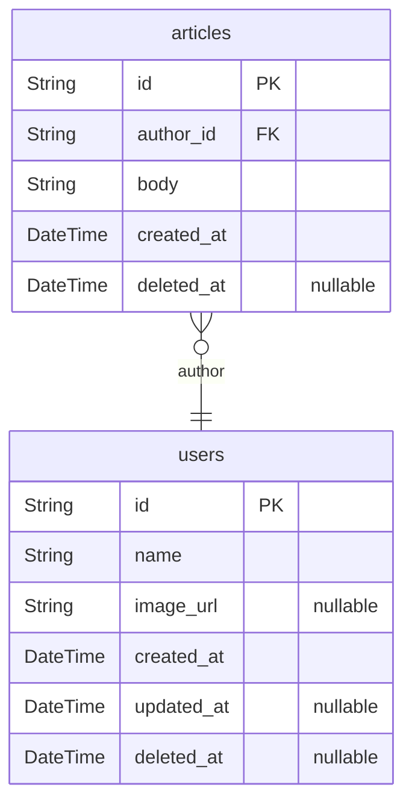
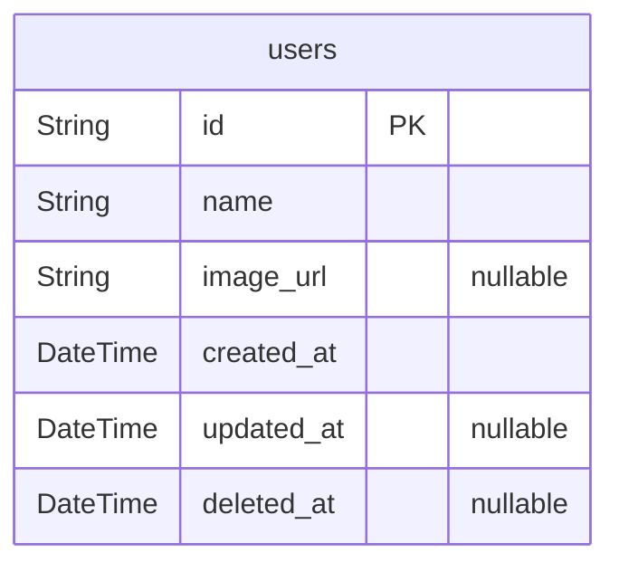

# Template

> Generated by [`prisma-markdown`](https://github.com/samchon/prisma-markdown)

- [All](#all)
- [User](#user)

## All

### `users`

Root Entity of User

**Properties**

- `id`: `uuid` string
- `name`: displayed name of user
- `image_url`: url of user profile image
- `created_at`:
- `updated_at`:
- `deleted_at`:

### `articles`

Root Entity of Article

**Properties**

- `id`: `uuid` string
- `author_id`
    > referenced in `users`
    >
    > `uuid` string
- `body`:
- `created_at`:
- `deleted_at`:

## User

### `users`

Root Entity of User

**Properties**

- `id`: `uuid` string
- `name`: displayed name of user
- `image_url`: url of user profile image
- `created_at`:
- `updated_at`:
- `deleted_at`:
